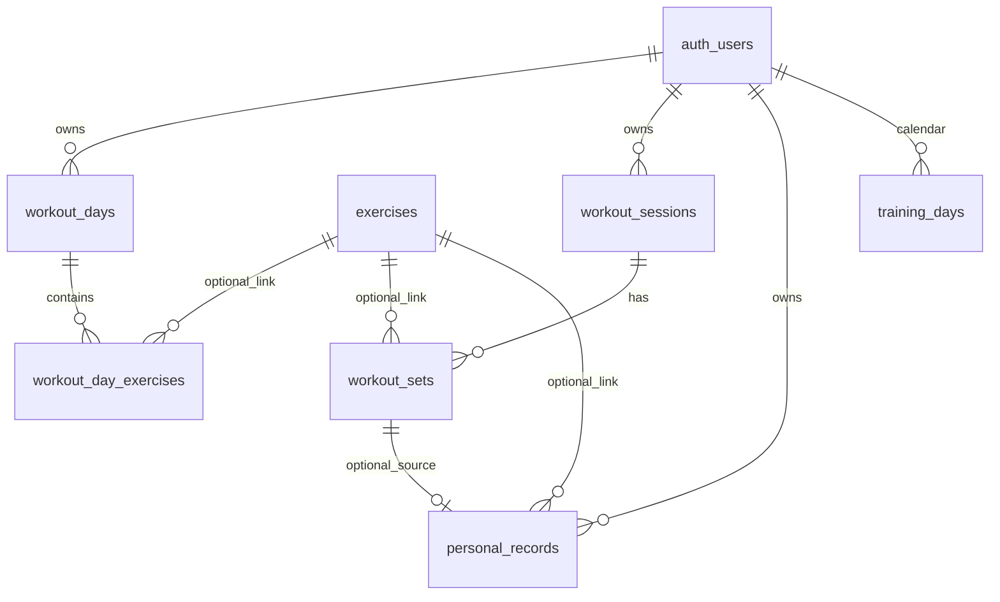

# Data model review (GymBro + Supabase trail)

Verified via **Supabase MCP** `execute_sql` and local migrations.

## Entity relationship (core)

## Foreign keys — verdict: **good**

| Child | Parent | ON DELETE | Notes |
|-------|--------|-----------|--------|
| `workout_day_exercises.day_id` | `workout_days` | CASCADE | Deleting section removes plan rows ✅ |
| `workout_sets.session_id` | `workout_sessions` | CASCADE | Sets die with session ✅ |
| `personal_records.user_id` | `auth.users` | CASCADE | User wipe removes PRs ✅ |
| `workout_days.user_id` | `auth.users` | CASCADE | ✅ |
| `training_days.user_id` | `auth.users` | CASCADE | ✅ |
| `workout_sessions.user_id` | `auth.users` | SET NULL | Legacy orphans; app claims via `storage_key` only |

**Intentional denormalization:** `workout_sessions.day` is **text** (section name), not FK to `workout_days.id`. Renaming a section updates session `day` in app code.

## Constraints — verdict: **well designed**

- `workout_sets`: UNIQUE `(session_id, exercise_name, set_number)` — prevents duplicate set rows ✅
- `workout_sets`: CHECK `weight_kg >= 0`, `reps >= 0`, `set_number > 0` ✅
- `workout_sessions`: UNIQUE `storage_key`, CHECK `rpe` 1–10 ✅
- `workout_days`: UNIQUE `(user_id, name)` — no duplicate section names ✅
- `personal_records`: UNIQUE `(user_id, exercise_name)` — one PR per lift ✅
- `training_days`: PRIMARY KEY `(user_id, trained_on)` ✅

**Minor redundancy:** two unique indexes on `personal_records (user_id, exercise_name)` — safe to drop one (see migration note).

## RLS — verdict: **good for multi-tenant anonymous app**

| Table | Model |
|-------|--------|
| `workout_sessions` | SELECT/WRITE `auth.uid() = user_id` |
| `workout_sets` | Access only if parent session owned |
| `workout_days` / `workout_day_exercises` | Via `workout_days.user_id` |
| `personal_records` | `auth.uid() = user_id` |
| `training_days` | `auth.uid() = user_id` |
| `exercises` / `muscle_groups` | Public read (catalog) |
| Orphan claim | UPDATE only `user_id IS NULL` + `storage_key` set |

Anonymous users are still isolated by `auth.uid()` per device account.

## Functions & triggers — **required and correct**

| Object | Role |
|--------|------|
| `set_workout_session_user_id()` | BEFORE INSERT on `workout_sessions` — sets `user_id` from JWT |
| `update_personal_record_on_set()` | AFTER INSERT on `workout_sets` — maintains `personal_records` |
| RPC EXECUTE | Revoked from `anon` / `authenticated` — triggers only, not direct API |

App also upserts PRs in `upsertPersonalRecordIfBetter` (belt-and-suspenders).

## Indexing — **very good** (not perfect)

| Index | Serves |
|-------|--------|
| `workout_sessions_user_day_ts_idx` | Main fetch: user + section + time ✅ |
| `workout_sessions_storage_key_key` | Local sync / claim ✅ |
| `workout_sets_session_idx` | Join sets to session ✅ |
| `workout_day_exercises_day_idx` | Load plan for section ✅ |
| `personal_records_user_achieved_idx` | Recent PRs ✅ |

**Optional future:** partial index `workout_sessions (user_id, day) WHERE status = 'in_progress'` if finish/status queries grow.

## Live data sanity (MCP)

- Chest: **6** plan exercises, **2** session days, volume **96 kg** = 3×8×4 kg ✅
- Back: **6** plan exercises, **0** sessions ✅
- **0** orphan sessions

## App ↔ schema alignment

- Saves write `workout_sets` + JSON `exercises` on session.
- `training_days` updated on each save (not only Finish).
- Section-scoped PRs and analytics filters in UI.
- `savedCount` only counts exercises **on the current plan** (fixes inflated counts).
